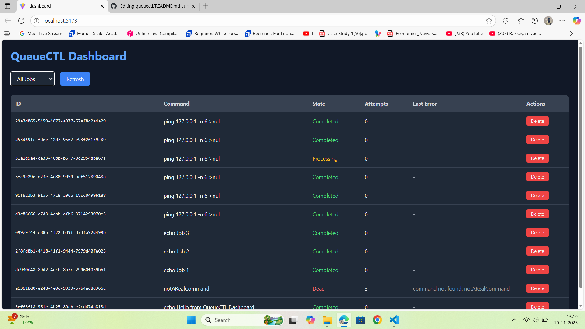

## 🚀 Features
- Enqueue shell commands as jobs  
- Worker processes handle job execution  
- Live dashboard for job tracking  
- Retry logic, backoff, and Dead Letter Queue  
- Local SQLite database — minimal infrastructure  

## 🖥️ QueueCTL Dashboard Preview

Below is a preview of the QueueCTL Dashboard interface showing job statuses and command tracking:

